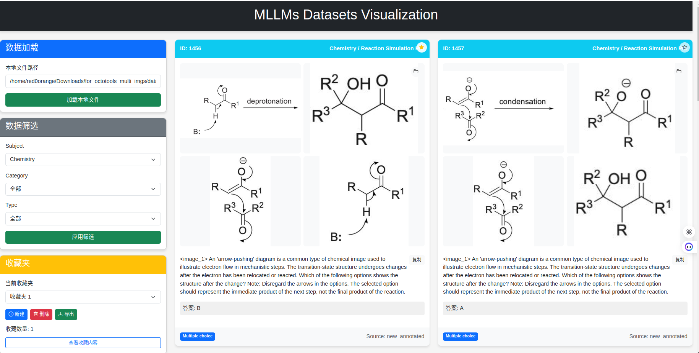

# VQA 数据可视化工具



这是一个基于 FastAPI 开发的 VQA（视觉问答）数据可视化工具，用于直观展示和管理 VQA 数据集。该工具提供了友好的用户界面，支持数据筛选、滚动加载、收藏管理和多图像显示等功能。

## 功能特点

### 数据加载和展示
- 支持加载本地JSON格式的VQA数据集
- 自动解析并展示问题、图像、答案等关键信息
- 响应式设计，适配不同设备和屏幕大小

### 数据浏览与交互
- 无限滚动加载，自动加载更多数据
- 点击可查看大图，支持多图像显示
- 一键复制问题文本功能
- 支持快速打开图像所在目录

### 高级筛选功能
- 按主题（Subject）筛选数据
- 按类别（Category）筛选数据
- 按类型（Type）筛选数据
- 实时统计筛选结果数量

### 收藏夹管理
- 创建多个收藏夹，每个收藏夹可包含不同内容
- 为收藏夹添加名称和描述
- 一键切换不同收藏夹
- 将数据项添加到/从收藏夹中移除
- 查看收藏夹内容
- 导出收藏夹为标准JSON格式

### 多图像支持
- 支持每个数据项包含多张图像
- 使用网格布局同时显示多张图像
- 点击可查看大图，支持图像缩放

## 安装与运行

### 环境要求
- Python 3.7+
- FastAPI
- Uvicorn

### 安装依赖
```bash
pip install -r requirements.txt
```

### 启动应用
```bash
python -m uvicorn app.main:app --host 0.0.0.0 --port 18000 --reload
```

应用将在 http://localhost:18000 运行。

## 使用指南

### 1. 加载数据集
1. 在首页输入本地JSON格式数据集的完整路径
2. 点击"加载"按钮，系统将解析并显示数据

### 2. 浏览与筛选
- 滚动页面可自动加载更多数据
- 使用顶部筛选器按主题、类别和类型筛选数据
- 点击"应用筛选"按钮查看筛选结果

### 3. 收藏夹使用
- 点击"新建"按钮创建新收藏夹
- 从下拉菜单选择要使用的收藏夹
- 点击数据卡片右上角的星形图标将项目添加到收藏夹
- 点击"查看收藏内容"按钮浏览当前收藏夹内容
- 点击"导出"按钮将收藏夹内容导出为JSON文件

### 4. 图像查看
- 点击图像可打开大图查看模式
- 对于多图像数据，会以网格方式显示全部图像
- 点击右上角文件夹图标可打开图像所在目录

## 数据格式

系统接受标准JSON格式的VQA数据，每个数据项应包含以下字段：

```json
{
  "pid": 1,                             // 数据项ID（必需）
  "question": "这是什么动物？",          // 问题文本（必需）
  "image": "path/to/image.jpg",         // 图像路径（字符串或数组）
  "answer": "猫",                       // 答案文本（必需）
  "subject": "动物",                    // 主题分类
  "category": "猫科动物",               // 类别
  "type": "简单识别",                   // 问题类型
  "source": "数据集A"                   // 数据来源
}
```

注意：`image` 字段可以是单个字符串路径，也可以是路径数组（多图像）。

## 本地存储
- 收藏夹数据保存在浏览器的本地存储中
- 关闭浏览器或重启系统后，收藏数据不会丢失
- 可以将收藏数据导出为标准JSON文件备份或分享

## 贡献与反馈

欢迎提交问题报告和功能建议，共同改进本工具。

## 许可证

[MIT License](LICENSE) 